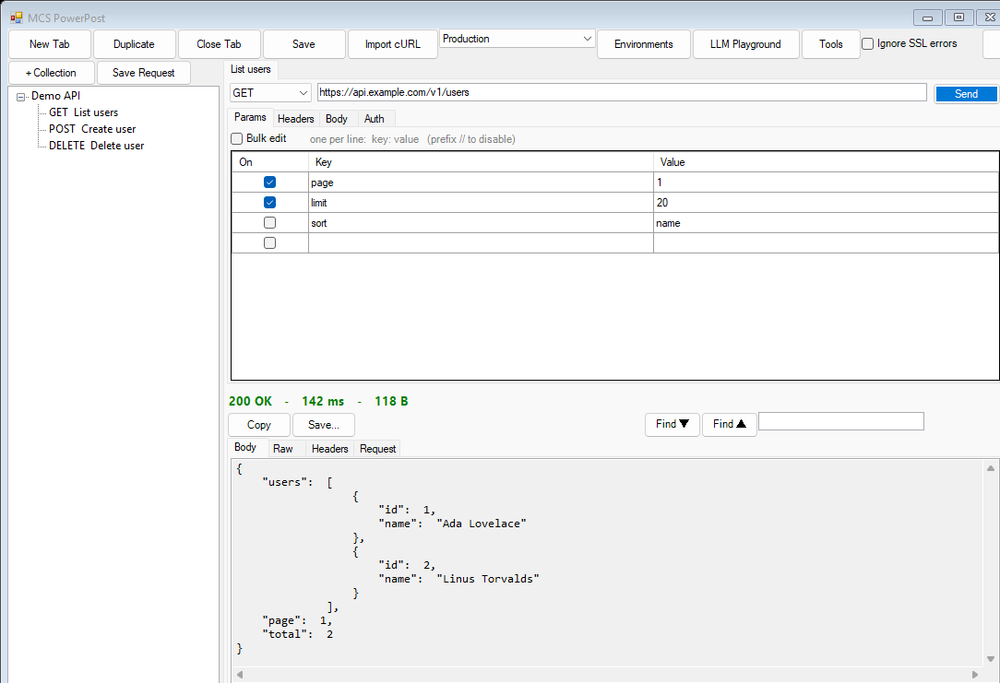

# MCS PowerPost

> A lightweight, single-folder **Postman replacement** for Windows — no account, no cloud, no telemetry.


**MCS PowerPost** is a tabbed API tester written in Windows PowerShell 5.1 + WinForms. It's a
single folder of scripts — nothing to install, no dependencies to restore — just a GUI for
hitting your own internal APIs. A [Major Computing Systems](https://majorcomputingsystems.ca)
product.



📸 **See the [Feature Tour](features.md)** for a screenshot-by-screenshot walkthrough of every feature.

## Table of contents

- [Feature Tour (with screenshots)](features.md)
- [Features](#features)
- [Getting started](#getting-started)
- [Usage](#usage)
  - [Keyboard shortcuts](#keyboard-shortcuts)
  - [Collections](#collections)
  - [Environments](#environments)
  - [Import & export](#import--export)
  - [LLM Playground](#llm-playground)
- [OAuth notes](#oauth-notes)
- [Security](#security)
- [Validate the build](#validate-the-build)
- [Project layout](#project-layout)
- [License](#license)
- [About](#about)

## Features

> 📸 Prefer pictures? The **[Feature Tour](features.md)** walks through each feature with screenshots.

- **Tabs** — each tab is an open request (method, URL, params, headers, body). Rename by
  double-clicking the tab header or right-click → Rename; Duplicate and Close from the
  toolbar or right-click menu.
- **Collections** — a left sidebar tree of saved requests grouped into collections. Save the
  current tab into a collection, double-click a saved request to open it in a new tab, and
  right-click to rename, duplicate, or delete. See [Collections](#collections).
- **Import OpenAPI / Postman** — **Tools → Import collection** turns an OpenAPI/Swagger spec or a
  Postman collection into a collection of ready-to-send requests (paths, methods, params, headers,
  and a JSON body skeleton from the schema).
- **Methods** — GET, POST, PUT, PATCH, DELETE, HEAD, OPTIONS.
- **File uploads** — the `Multipart form-data` body lets you mix text fields and files; pick a
  file per row with the **...** button. Sent as `multipart/form-data` via `HttpClient`.
- **cURL import / export** — paste a cURL command (toolbar **Import cURL**) to build a request in
  a new tab, or right-click a tab → **Copy as cURL** / **Copy as PowerShell** to copy a runnable
  snippet of the current request. See [Import & export](#import--export).
- **LLM Playground** — a Postman-style, **tabbed** workbench for testing LLM endpoints (OpenAI,
  Anthropic, Gemini AI Studio, and Vertex AI) with text **and image** input. Each tab is a saved
  chat (provider/model/system/params + full conversation), and every send shows the underlying
  REST call (status, time, size, response headers, and the exact request). See
  [LLM Playground](#llm-playground).
- **Environments & variables** — define named environments of `{{variable}}` values and switch
  between them from the toolbar. Tokens like `{{baseUrl}}` / `{{token}}` are substituted into the
  URL, params, headers, body, form fields, and auth at send time (the `Request` preview shows the
  resolved values). See [Environments](#environments).
- **Params / Headers** — enable/disable individual rows; params are merged into the query
  string at send time. Each has a **Bulk edit** toggle to edit them as `key: value` text
  (one per line; prefix `//` to disable a row).
- **Body** — `No body`, `JSON`, `Text`, `Form URL-encoded`, `Multipart form-data`
  (text **and file** fields, for uploads), or `GraphQL` (query + JSON variables, sent as
  `{"query":…,"variables":…}`) — the right `Content-Type` is set automatically.
- **Auth**
  - **None**
  - **Bearer / JWT** — paste a token, sent as `Authorization: Bearer <token>`.
  - **Basic** — username/password → Basic header.
  - **OAuth2 Client Credentials** — token URL, client id/secret, scope; credentials sent
    in the body or as a Basic header. `Get Token` fetches one; tokens are cached with
    their expiry and auto-refreshed on Send.
  - **OAuth2 Authorization Code (+ PKCE)** — opens your browser to sign in, captures the
    redirect on `http://localhost:<port>/`, and exchanges the code for a token.
  - **Inherit (collection)** — use the parent collection's auth (set via right-click a collection →
    **Collection auth…**); resolved into the request when you open it from the collection.
- **Response** — status code + reason, elapsed time and size; pretty-printed JSON body,
  raw body, and a response-headers grid; **find-in-response** (search box with next/prev over the
  Body/Raw/Request views); Copy and Save-to-file.
- **Tests** — declarative post-response assertions (status, time, a JSON-body path, a header, or
  the raw body) with operators like equals / contains / less-than / exists / matches; results show
  pass/fail in the response panel after every send.
- **Saved examples** — snapshot a response onto a request as a named **example** and re-view it any
  time (response bar → **Examples ▾**).
- **Request history** — every send is logged (method/URL/status/time); **Tools → Request history**
  lists recent sends and reopens any of them in a new tab.
- **Cookie jar** — a shared cookie store persists `Set-Cookie` values across requests (and
  restarts); **Tools → Cookies** lists/deletes/clears them, and **Tools → Settings** toggles it.
- **Settings** — **Tools → Settings** controls request timeout, follow-redirects, an HTTP proxy,
  and the cookie jar.
- **Request preview** — a `Request` tab in the response panel shows the *exact* request
  that went on the wire after each Send (final URL with params merged, every header
  including the resolved auth header, and the body), so you can tell at a glance whether a
  failure is your request or the server.
- **Self-signed certs** — toolbar `Ignore SSL errors` checkbox for internal HTTPS.
- **State** — saved to `powerpost.state.json` **next to the script**, on `Save` (Ctrl+S)
  and automatically when you close the window. Reopens exactly where you left off.

## Getting started

**Requirements:** Windows with the in-box Windows PowerShell 5.1 (not PowerShell 7+).

1. Clone or download this repository.
2. Launch it:
   - Double-click **`Run-PowerPost.cmd`**, **or**
   - From a terminal:
     ```powershell
     powershell -STA -ExecutionPolicy Bypass -File .\PowerPost.ps1
     ```

   The script auto-relaunches itself under `-STA` if needed — STA is required for WinForms.

## Usage

Open a tab, choose a method, type a URL, fill in params/headers/body/auth as needed, and hit
**Send**. The response panel shows the status, timing, size, a pretty-printed body, the raw
body, response headers, and the exact request that was sent.

### Keyboard shortcuts

| Shortcut | Action |
| --- | --- |
| `Ctrl+Enter` / `F5` | Send the current request |
| `Ctrl+T` | New tab |
| `Ctrl+W` | Close tab |
| `Ctrl+S` | Save state |

### Collections

Tabs are your working set; **collections** are your saved library. Use the sidebar on the left:

1. Click **+ Collection** (or right-click → New Collection) and name it.
2. With a collection (or one of its requests) selected, click **Save Request** to store a
   snapshot of the current tab into it — or right-click a collection → **Add Current Request Here**.
3. **Double-click** a saved request to open it in a new tab. It opens as a *copy*, so editing the
   tab doesn't change the saved request until you save again.
4. Right-click any node to **Rename**, **Duplicate** (requests), or **Delete**.
5. Right-click a collection → **Collection auth…** to set a default auth. Requests whose Auth is
   **Inherit (collection)** pick it up when opened from that collection.

Collections are saved in `powerpost.state.json` alongside your open tabs, so your library persists
between sessions. Saved requests use the same format as tabs, so everything — params, headers,
body, auth, and `{{variables}}` — is preserved.

### Environments

Use environments to avoid hard-coding hosts, tokens, and other values that change between (say)
local, staging, and production.

1. Click **Environments** in the toolbar to open the manager.
2. **Add** an environment, give it a name, and fill the variable grid with `key` / `value` rows
   (disable a row to leave it out without deleting it).
3. Click **OK**, then pick the environment from the toolbar dropdown (or **No Environment** to
   send literal values).

Anywhere in a request you can then write `{{key}}` and it is replaced at send time — in the URL,
params, headers, body, form fields, and the auth fields (bearer token, basic creds, OAuth URLs/
client id/secret/scope). Inner spaces are tolerated, so `{{ key }}` works too. Unknown or disabled
variables are left untouched (e.g. `{{missing}}` is sent as-is) so you can spot mistakes. The
`Request` tab in the response panel always shows the fully-resolved request that went on the wire.

Environments and the active selection are saved in `powerpost.state.json` along with everything
else. **Note:** variable values are stored in plaintext — see [Security](#security).

### Import & export

- **Import cURL** (toolbar) — paste a cURL command and PowerPost parses it into a new tab:
  method, URL, headers, body (JSON / form / text, or `-F` → multipart with file fields), and
  `-u` or `Authorization: Bearer`/`Basic` headers become the request's auth. Common no-op flags
  (`-k`, `-L`, `-s`, …) are ignored.
- **Copy as cURL** / **Copy as PowerShell** (right-click a tab) — copies the current request to
  the clipboard as a bash-style `curl` command or an `Invoke-RestMethod` script. `{{variables}}`
  are resolved against the active environment first, so the snippet is runnable as-is. (For OAuth
  auth, the snippet includes a token only if one has already been fetched. Multipart/file bodies
  export to `curl -F`; the PowerShell snippet notes them rather than inlining file uploads.)

### LLM Playground

Click **LLM Playground** in the toolbar to open a chat window for testing LLM endpoints across
providers. It ships knowing four **dialects**:

| Provider | Dialect (body) | Auth |
| --- | --- | --- |
| OpenAI (and OpenAI-compatible: Groq, OpenRouter, Azure, Ollama) | `openai` | `bearer` API key |
| Anthropic | `anthropic` | `x-api-key` |
| Gemini (AI Studio) | `gemini` | `x-goog-api-key` |
| Vertex AI (Gemini) | `gemini` | `vertex` — service-account JWT → OAuth token |

The window is **tabbed** like the main app — **New Chat** / **Close Chat**, double-click a tab to
rename (or right-click for **New / Duplicate / Rename / Close**), and **Save** to persist. Each tab keeps its own provider/model/system/params **and its full
conversation**, so you can come back to exactly where you were. The Playground **does not auto-save**
— click **Save** before closing or your unsaved changes are discarded.

Usage:

1. **Providers…** opens a JSON editor of the provider catalog. Fill in your API key (or paste
   `{{var}}` and supply it from an [environment](#environments)). For **Vertex AI**, click
   **Import from file…** and select an `llm-providers.json` (the
   `Name`/`Provider`/`Model`/`Endpoint`/`ClientEmail`/`PrivateKey` shape). `VertexAI` entries that
   share an endpoint + service account are **consolidated into one "Google Vertex" provider** whose
   Model dropdown lists every model (it's one endpoint + credential — the model is just a choice),
   mapped to the gemini dialect with service-account auth automatically.
2. Pick a **Provider** and **Model**, optionally set a **System** prompt (multiline), **Max tok**,
   **Temp**, and **Thinking** (see below).
3. Type a message and/or **Attach image(s)**, and **Send** (or Ctrl+Enter) — a message, an image
   alone, or just a system prompt is enough to send. The reply appears
   in the transcript; the lower **details** pane shows the REST call for that send — **Response**
   (status / time / size + pretty JSON), **Resp Headers**, and **Request** (the exact URL, headers,
   and JSON body that went on the wire).

Images are read from disk and encoded the way each provider expects (base64 `image_url` for
OpenAI, `image` source blocks for Anthropic, `inline_data` for Gemini/Vertex) — so you can OCR or
describe an image straight from a file path. Non-streaming in this version (send → wait → reply).
A pending (attached-but-not-yet-sent) image is saved with the tab too, so it survives a save/reload.

**Thinking** controls how much the model reasons before answering, mapped per provider:

| Thinking | Gemini 3.x | Gemini 2.5 | Anthropic | OpenAI |
| --- | --- | --- | --- | --- |
| Default | (model default) | (model default) | (model default) | (model default) |
| Off | `thinkingLevel: low`* | `thinkingBudget: 0` | `thinking: disabled` | — |
| Low / Medium / High | `thinkingLevel: low/medium/high` | `thinkingBudget: 512 / 2048 / 8192` | adaptive + `effort: low/medium/high` | `reasoning_effort: low/medium/high` |

The **Default** item shows the model's *effective* level in parentheses (e.g. `Default (high)` for
gemini-3.1-pro, `Default (dynamic)` for gemini-2.5) — i.e. what the model does when PowerPost sends
no thinking parameter. **New chats start at the least thinking the model supports** (Off where it
can be disabled, otherwise the lowest level), so you opt *in* to heavier reasoning rather than
inheriting an expensive default.

\* Gemini 3 models can't fully disable thinking, so **Off** maps to the lowest level. If a specific
model rejects a setting, the error shows in the **Response** tab — switch **Thinking** back to
**Default**. Note: thinking models spend the token budget on reasoning first, so pair higher
thinking with a generous **Max tok** (the default is 4096).

> **Vertex AI** authenticates by signing a JWT with your service-account private key (RS256) and
> exchanging it for a short-lived access token, which is cached until it expires.

## OAuth notes

- **Authorization Code:** the redirect URI is `http://localhost:<Redirect Port>/` (default
  `8080`). That exact URI must be registered as an allowed redirect/callback in your
  identity provider's app/client config, or sign-in will fail. Leave **Use PKCE** on for
  public clients; add a Client Secret for confidential clients.
- **Client Credentials:** choose whether the client id/secret go in the request body or as
  a `Basic` auth header (`Credentials in` dropdown) to match what your token endpoint
  expects.

## Security

Secrets (bearer tokens, client secrets, passwords) and fetched OAuth tokens are saved in
**plaintext** in `powerpost.state.json` — including **LLM provider API keys and Vertex AI
service-account private keys** entered in the Playground. This is intended for development
credentials against internal APIs. The file is git-ignored by default — don't commit it, and
don't store production secrets in it. Saved **cookies** (which can include session tokens) are also
stored there in plaintext — use **Tools → Cookies → Clear all** to wipe them. To keep keys out of
the file entirely, write them as `{{var}}` and supply them from an [environment](#environments). If a private key is ever
exposed, **rotate it** at the provider.

## Validate the build

```powershell
powershell -File .\PowerPost.ps1 -SelfTest
```

Runs quick local checks (state round-trip, JSON formatter, PKCE S256 vector, and a live
GET/POST against postman-echo.com) and prints PASS/FAIL per check.

## Project layout

```
PowerPost.ps1        entry point: STA guard, TLS/cert setup, loads lib\, self-test, launch
Run-PowerPost.cmd    double-click launcher
lib\Model.ps1        data model + JSON normalization
lib\State.ps1        load/save powerpost.state.json
lib\Json.ps1         JSON pretty-printer
lib\Http.ps1         request execution via HttpClient
lib\Auth.ps1         auth headers + OAuth2 token acquisition (client-creds, auth-code+PKCE)
lib\Vars.ps1         {{variable}} substitution (environments)
lib\Curl.ps1         cURL import + cURL/PowerShell export
lib\Import.ps1       OpenAPI/Swagger + Postman collection import
lib\Llm.ps1          LLM adapters (openai/anthropic/gemini) + Vertex service-account JWT
lib\Ui.Controls.ps1  reusable WinForms builders (grids, fields, auth panel)
lib\Ui.Env.ps1       environment selector + manager dialog
lib\Ui.Collections.ps1  collections sidebar (tree of saved requests) + commands
lib\Ui.Code.ps1      cURL import dialog + copy-as-cURL/PowerShell commands
lib\Ui.Llm.ps1       LLM Playground window + provider JSON config dialog
lib\Ui.Tools.ps1     Settings dialog + Request history viewer
lib\Ui.Tab.ps1       per-tab editor + response panel (incl. find-in-response) + model<->controls sync
lib\Ui.Send.ps1      send, render response, fetch tokens, save response
lib\Ui.Main.ps1      main window, toolbar, tab management, save/close, About
```

## License

Licensed under the [MIT License](LICENSE) — © 2026 Major Computing Systems. You're free to use,
modify, and distribute it; just keep the copyright and license notice in copies.

**Attribution:** if you use MCS PowerPost inside an organization or business, please credit
**Major Computing Systems** ([majorcomputingsystems.ca](https://majorcomputingsystems.ca)) — for
example in internal docs, a tooling page, or an about/credits screen. Retaining the notice is
*required* when you redistribute or bundle the software under MIT; for purely internal use it's a
kindly-requested courtesy.

## About

**MCS PowerPost** is built and maintained by **Major Computing Systems** —
[majorcomputingsystems.ca](https://majorcomputingsystems.ca).
