# MCS PowerPost — Feature Tour

A visual, screenshot-by-screenshot walkthrough of everything **MCS PowerPost** can do. PowerPost is
a single-folder, zero-install API client for Windows (PowerShell 5.1 + WinForms) — a Postman-style
workbench plus a multi-provider **LLM Playground**, by
[Major Computing Systems](https://majorcomputingsystems.ca).

> Launch it with `Run-PowerPost.cmd` (or `powershell -STA -File .\PowerPost.ps1`). State is saved
> next to the script in the git-ignored `powerpost.state.json` when you press **Save** (Ctrl+S) or
> close the window.

## Contents

**Requests & responses**
- [The main window](#the-main-window)
- [Response viewer — Body, Raw, Headers, Request, Find](#response-viewer)
- [Bulk-edit params & headers](#bulk-edit-params--headers)
- [Tests — post-response assertions](#tests--post-response-assertions)
- [Saved response examples](#saved-response-examples)

**Request bodies**
- [JSON / Text](#json--text-body)
- [Multipart form-data & file upload](#multipart-form-data--file-upload)
- [GraphQL](#graphql)

**Auth & organization**
- [Authentication](#authentication)
- [Collections](#collections)
- [Collection-level (inherited) auth](#collection-level-inherited-auth)
- [Import OpenAPI / Postman collections](#import-openapi--postman-collections)

**Environments & import/export**
- [Environments & variables](#environments--variables)
- [Import cURL & copy-as](#import-curl--copy-as)

**Tools**
- [Request history](#request-history)
- [Cookie jar](#cookie-jar)
- [Settings](#settings)

**LLM Playground**
- [Chat + image testing](#llm-playground--chat--image-testing)
- [The REST call behind every reply](#the-rest-call-behind-every-reply)
- [Multiple saved chats](#multiple-saved-chats)
- [Provider catalog](#llm-provider-catalog)

**About**
- [About](#about)

---

# Requests & responses

## The main window

The home base: a **tabbed request editor** on top (method, URL, **Params / Headers / Body / Auth**)
and a **response viewer** below. The left sidebar is your [Collections](#collections) library; the
toolbar has tab controls, **Save**, **Import cURL**, the active-[environment](#environments--variables)
picker, the **LLM Playground**, a **Tools** menu, and an **Ignore SSL errors** toggle for internal
HTTPS.

**How to use it.** Choose a method, type a URL (use `{{variables}}` for environment values), add
query **Params** and **Headers** (tick the **On** box to enable/disable a row without deleting it),
then click **Send**.

## Response viewer

The response panel shows the **status code, elapsed time, and size**, with four sub-tabs:

- **Body** — pretty-printed JSON (see the [main window](#the-main-window)).
- **Raw** — the unformatted payload exactly as received.
- **Headers** — every response header in a grid.
- **Request** — the exact request that went on the wire (method, URL, resolved headers, body).

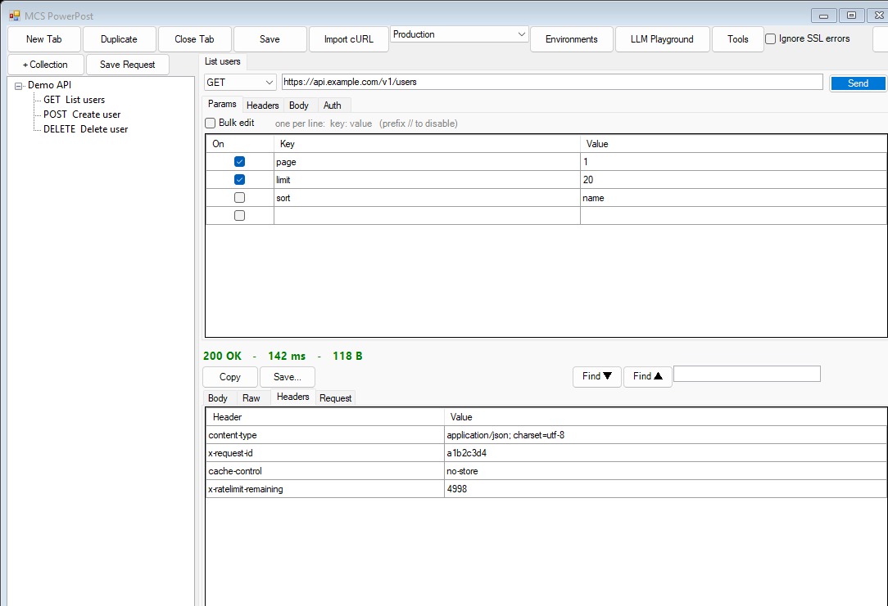

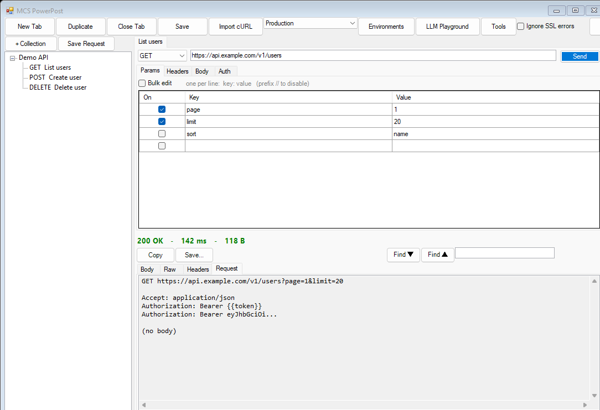

A **Find ▼ / ▲** box searches within any of these views (great for large responses), and **Copy** /
**Save…** export the body.

## Bulk-edit params & headers

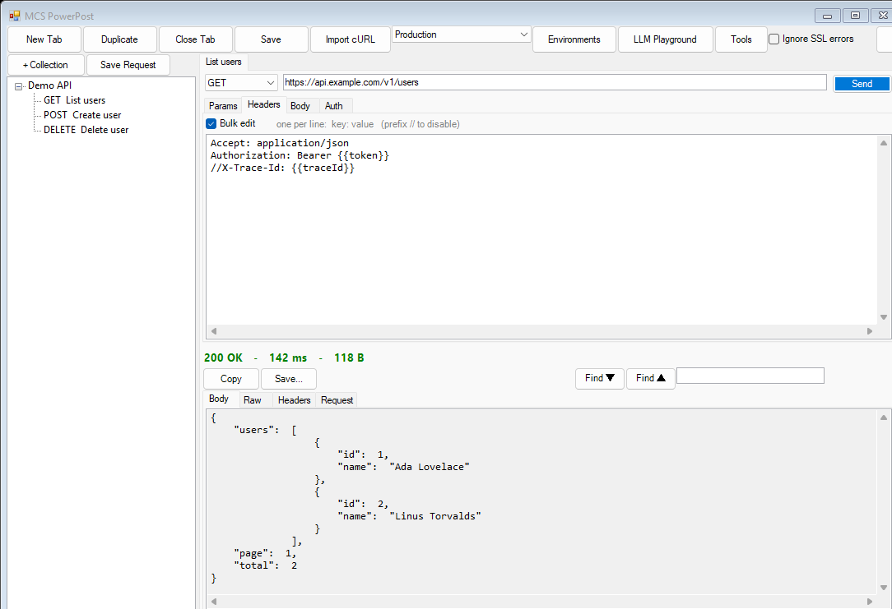

**What it is.** A fast way to edit many rows at once. Tick **Bulk edit** on the Params or Headers
tab and the grid becomes a text box — one `key: value` per line; prefix a line with `//` to keep it
but disable it. Untick to parse it back into the grid. Perfect for pasting a block of headers.

## Tests — post-response assertions

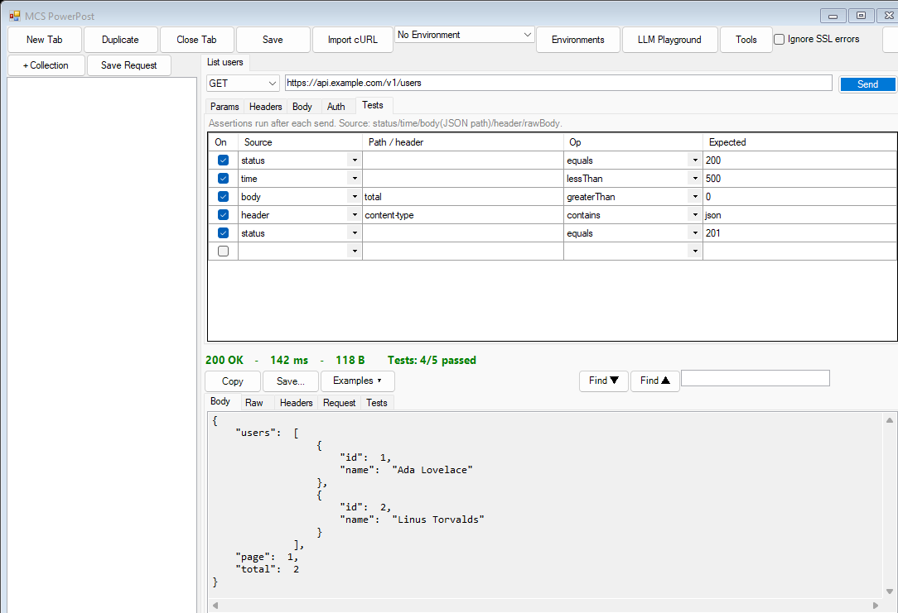

**What it is.** A request's **Tests** tab holds declarative assertions that run automatically after
each send. Each row checks one facet of the response:

- **Source** — `status` (code), `time` (ms), `body` (a dotted JSON path like `data.items.0.id`),
  `header` (by name), or `rawBody`.
- **Op** — `equals`, `notEquals`, `contains`, `notContains`, `lessThan`, `greaterThan`, `exists`,
  `notExists`, or `matches` (regex).
- **Expected** — the value to compare against.

Results appear in the response panel's **Tests** sub-tab as colored pass/fail, with a summary on
the status line (e.g. *Tests: 4/5 passed*):

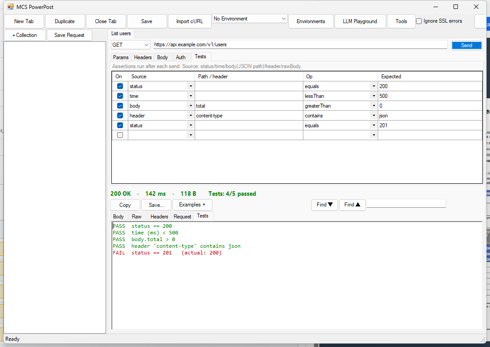

**How to use it.** On the **Tests** tab, add rows (e.g. *status equals 200*, *time lessThan 500*,
*body.total greaterThan 0*, *header content-type contains json*) and **Send** — the checks run and
report automatically.

## Saved response examples

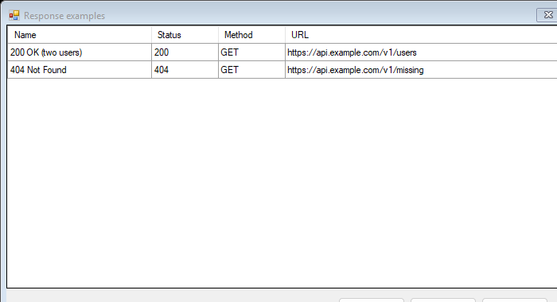

**What it is.** Snapshot a response and keep it on the request as a named **example** — a reference
of "what this endpoint returned" you can re-view without re-sending.

**How to use it.** After a response comes back, click **Examples ▾** in the response bar →
**Save response as example…** and name it. Re-open any saved example from the same menu to display
it in the response viewer, or choose **Manage examples…** to view/delete them.

---

# Request bodies

The **Body** tab supports every common shape and sets the correct `Content-Type` automatically:
`No body`, `JSON`, `Text`, `Form URL-encoded`, `Multipart form-data`, and `GraphQL`.

## JSON / Text body

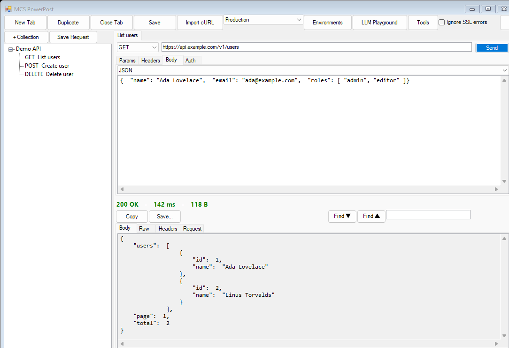

A simple editor for raw JSON or plain text bodies (sent as `application/json` / `text/plain`).

## Multipart form-data & file upload

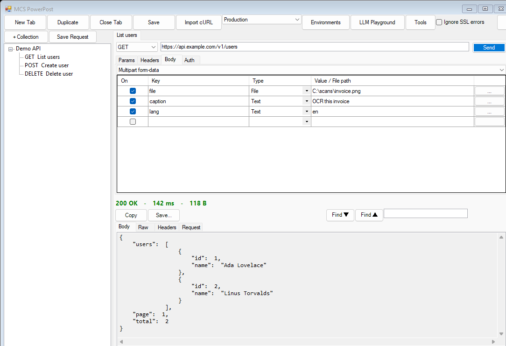

**What it is.** Mix text fields **and file uploads** in one request — set each row's **Type** to
*Text* or *File* and use the `…` button to pick a file. Ideal for uploads and OCR endpoints. (cURL
import maps `-F` to these rows, and export emits `curl -F`.)

## GraphQL

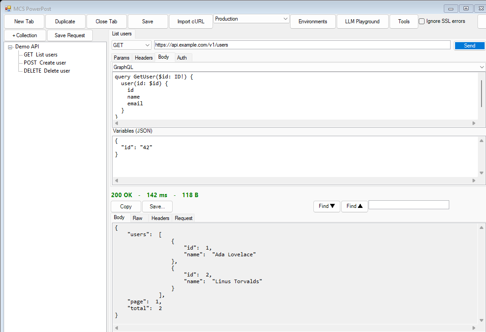

**What it is.** A dedicated **Query** box plus a **Variables (JSON)** box. PowerPost sends them as
`{"query": …, "variables": …}` with `application/json`, and `{{variables}}` expand in both boxes.

---

# Auth & organization

## Authentication

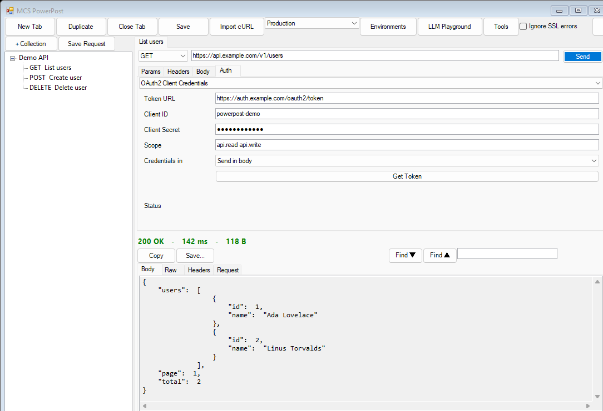

**What it is.** Every request's **Auth** tab offers:

- **Bearer / JWT** — adds `Authorization: Bearer …`.
- **Basic** — username / password.
- **OAuth2 Client Credentials** *(shown above)* — fetches and auto-refreshes a token from your
  token endpoint (credentials in the body or as a Basic header).
- **OAuth2 Authorization Code (+ PKCE)** — opens your browser to sign in, captures the
  `http://localhost:<port>/` redirect, and exchanges the code for a token.
- **Inherit (collection)** — use the parent [collection's auth](#collection-level-inherited-auth).

**How to use it.** Pick a type, fill in the fields, and (for OAuth2) click **Get Token**; PowerPost
caches it and attaches it to subsequent sends.

## Collections

The left sidebar (see the [main window](#the-main-window)) is a tree of **collections** — named
groups of saved requests.

**How to use it.** **+ Collection** makes a group; **Save Request** stores the active tab into the
selected collection. **Double-click** a saved request to open it in a new tab (as a copy). Right-click
any node for **Open / New Collection / Add Current Request / Rename / Duplicate / Collection auth… /
Delete**.

## Collection-level (inherited) auth

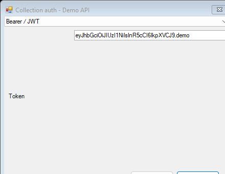

**What it is.** Set authentication **once per collection** and let its requests inherit it.

**How to use it.** Right-click a collection → **Collection auth…**, configure it (e.g. a bearer
token). Then in a request, set **Auth → Inherit (collection)**; opening it from the collection fills
in the collection's auth automatically.

## Import OpenAPI / Postman collections

**What it is.** Turn an existing API definition into a ready-to-send collection. PowerPost reads
**OpenAPI 3 / Swagger 2** (a request per path + method, with a JSON body skeleton generated from the
schema) and **Postman v2** collections (folders flattened, bodies + auth mapped).

**How to use it.** **Tools → Import collection (OpenAPI/Postman)…**, pick the `.json` file — the new
collection appears in the sidebar. (Tested on real specs: a 27-endpoint Swagger file imports in one
click.)

---

# Environments & import/export

## Environments & variables

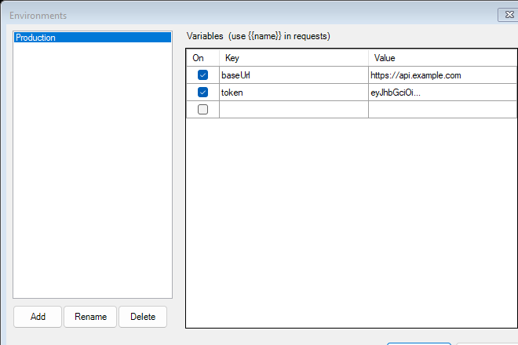

**What it is.** Named sets of `{{variable}}` values — e.g. a **Production** environment with a
`baseUrl` and `token`. Every `{{var}}` in your URL, params, headers, body, and auth resolves to the
active environment's value **at send time**; the saved request keeps the `{{…}}` placeholder.

**How to use it.** Toolbar → **Environments** → **Add** an environment and fill in variables;
reference them as `{{baseUrl}}`, `{{token}}`, etc.; switch the active environment from the toolbar
combo. This is also the cleanest way to keep secrets out of saved requests.

## Import cURL & copy-as

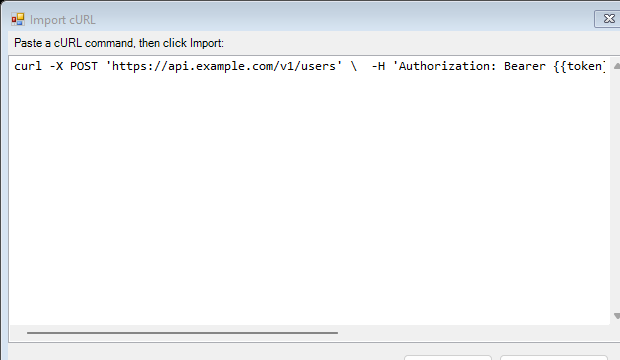

**What it is.** Paste a `curl` command and PowerPost parses it into a ready-to-send request — method,
URL, headers, and body filled in.

**How to use it.** Toolbar → **Import cURL**, paste, **Import**. Going the other way, right-click a
tab → **Copy as cURL** or **Copy as PowerShell** to share the current request as a runnable command
(with `{{variables}}` expanded).

---

# Tools

## Request history

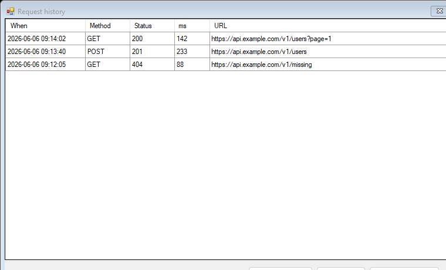

**What it is.** Every send is logged automatically — method, URL, status, time, and timestamp.

**How to use it.** **Tools → Request history**; double-click an entry (or **Open in new tab**) to
reload that exact request. **Clear history** empties the list.

## Cookie jar

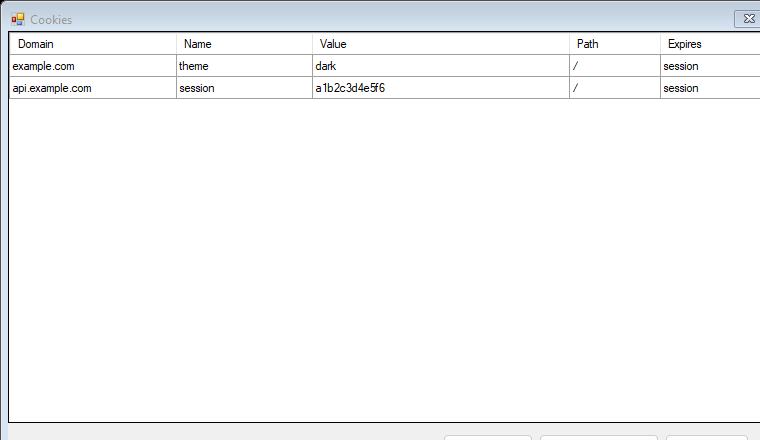

**What it is.** A shared cookie store that persists `Set-Cookie` values across requests and
restarts, so login/session flows just work on subsequent calls.

**How to use it.** On by default. **Tools → Cookies** to view / **Delete selected** / **Clear all**;
toggle the whole jar in [Settings](#settings).

## Settings

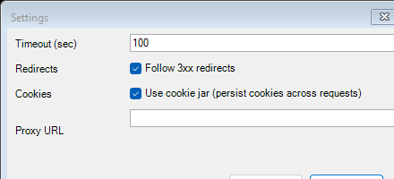

**What it is.** Per-app request behavior: request **timeout**, **follow 3xx redirects**, the
**cookie jar** toggle, and an optional **HTTP proxy**.

**How to use it.** **Tools → Settings**, adjust, **OK**.

---

# LLM Playground

A Postman-style, **tabbed** workbench for testing LLM chat — and **image sending** — across
**OpenAI, Anthropic, Google Gemini (AI Studio), and Google Vertex AI**, all from one window.

## LLM Playground — chat + image testing

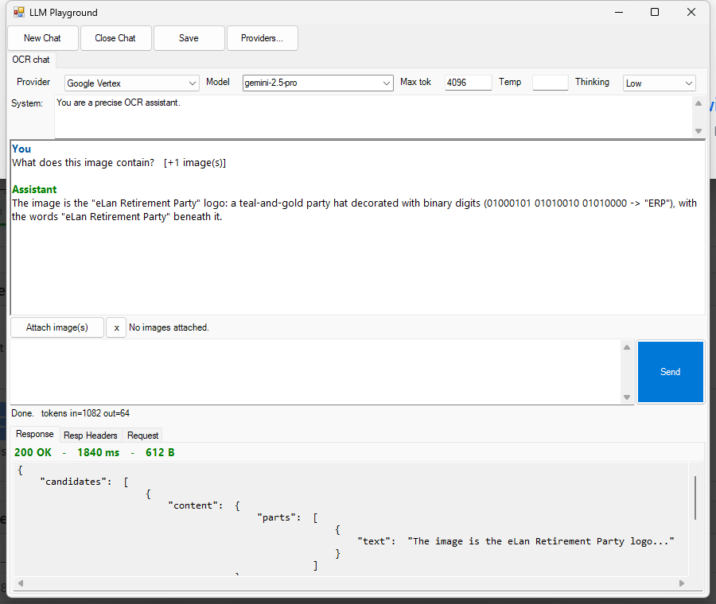

**What it is.** Each tab keeps its own provider, model, system prompt, parameters (Max tokens,
Temperature, **Thinking** level) **and** its full conversation. Attach images and chat with vision
models; the reply shows in the transcript with token usage.

**How to use it.** Toolbar → **LLM Playground**. Pick a **Provider** + **Model**, set a **System**
prompt, type a message and/or **Attach image(s)**, then **Send** (a message, an image alone, or just
a system prompt is enough).

## The REST call behind every reply

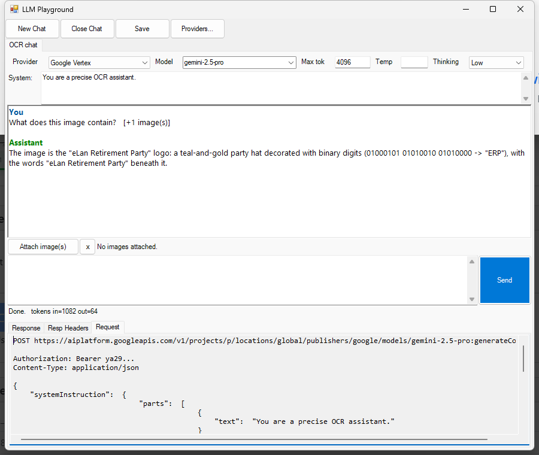

**What it is.** Every reply records the **exact REST call** — under **Response / Resp Headers /
Request** you can inspect the status, time, size, response JSON, and the full request body PowerPost
built for that provider's dialect (here, a Vertex Gemini `generateContent` call with a base64 image).

## Multiple saved chats

**What it is.** Keep several conversations side by side — one per tab — each with its own provider and
settings. Right-click the tab strip for **New / Duplicate / Rename / Close**, and click **Save** to
persist your sessions (the Playground does **not** auto-save).

## LLM provider catalog

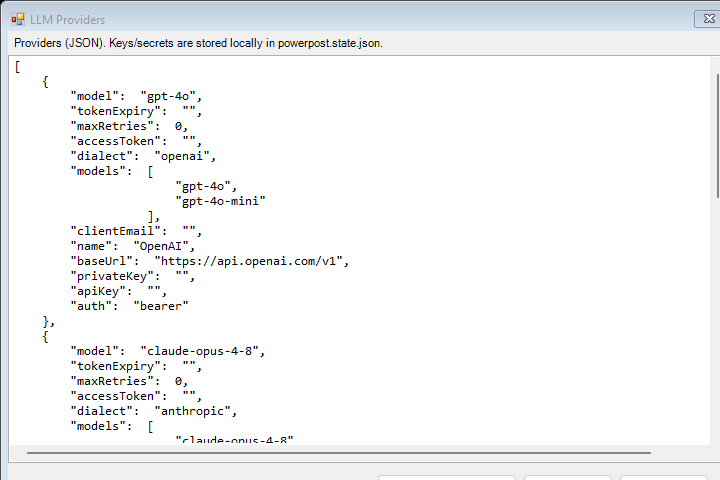

**What it is.** Providers are just data — a JSON catalog of endpoints, models, auth type, and
credentials. Defaults ship with **no secrets**; you add your keys locally. Vertex AI uses a
service-account (the app builds the signed JWT → OAuth token for you).

**How to use it.** In the Playground, click **Providers…** to edit the JSON, or **Import from
file…** to load an existing `llm-providers.json`. Keys are stored locally in the git-ignored
`powerpost.state.json` — never commit that file; prefer `{{variables}}` from an environment for
shared setups.

---

# About

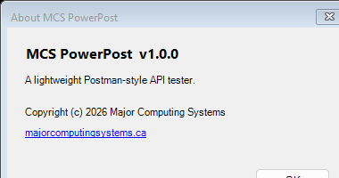

PowerPost is a single-folder app with an in-window **About** screen (toolbar → **About**) showing the
version, copyright, and a link to [majorcomputingsystems.ca](https://majorcomputingsystems.ca).

---

*MCS PowerPost is © Major Computing Systems — [majorcomputingsystems.ca](https://majorcomputingsystems.ca).*
